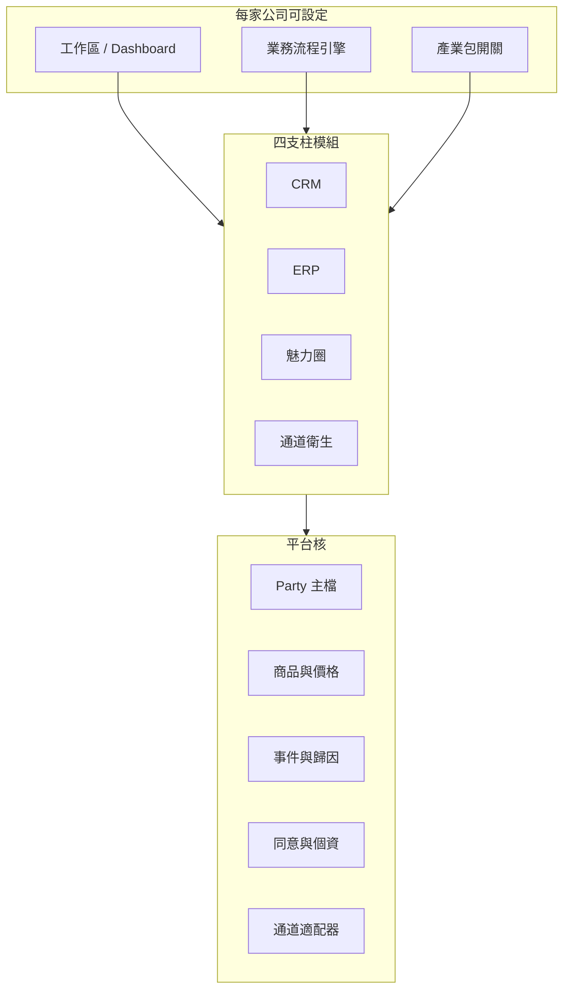
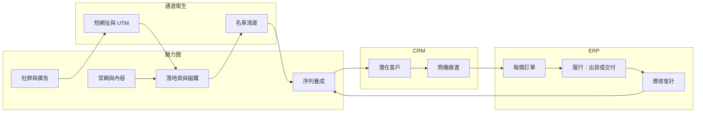
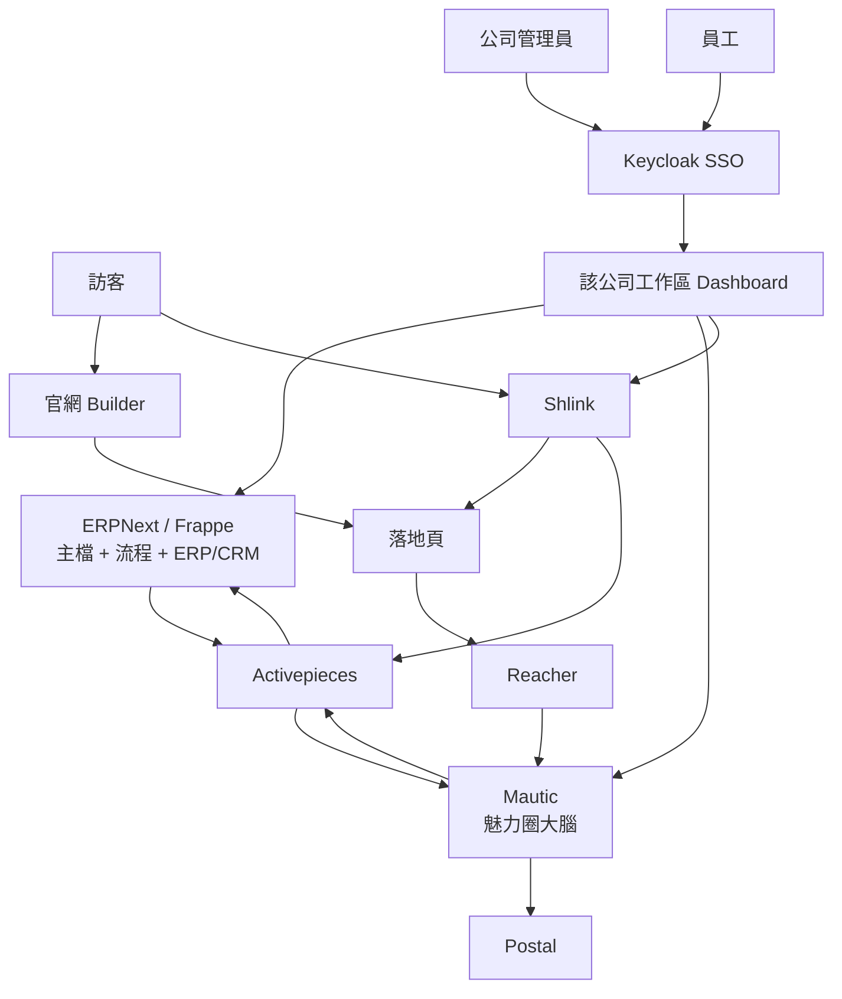

# EveryThingOS 架構

狀態：產品外殼與 100 產業包已落地（`web/`），開源後端組裝依分期進行  
商業：每年 NT$100,000 未稅，免費顧問導入，全模組套琢奧識別  
對象：要把 CRM、ERP、魅力圈漏斗、名單清庫、網址追蹤編成**可賣給各產業的一套作業系統**的決策者與實作者

---

## 0. 決策紀錄（五題第一輪）

這些答案會綁住後面每一個技術選擇。之後若改，改這裡，不要只改程式。

| # | 問題 | 第一輪答案 | 對架構的強制後果 |
| --- | --- | --- | --- |
| 1 | 第一批服務哪種生意？ | **混合／全產業** | 核心必須是水平平台，產業差異用「產業包」開關，禁止把某一行的欄位寫死進核心 |
| 2 | 自用還是要賣？ | **自己先用、驗證後再賣** | 第一天就用「一公司一站」的租戶模型；先不要做計費，但不要做成無法複製的單機特例 |
| 3 | 員工每天住哪個畫面？ | **必須能控制主畫面 Dashboard，以及公司自己的業務流程** | 儀表板與流程引擎是平台能力，不是我們替所有客戶選死 A/B/C |
| 4 | 台灣獲客主通道？ | **Email、LINE 之外，還有社群媒體與官方網站** | 通道是可插拔適配器。官網第一期就要在產品裡；社群與 LINE 走同一套 UTM／短網址／事件，不要各做各的 |
| 5 | 第一期「一筆生意」完成定義？ | **要有彈性；目標是像 Odoo 一樣強、一樣廣，甚至更好** | 預設提供一條可跑通的範本閉環，但階段、欄位、是否出貨／是否收款，全部可依公司設定 |

一句話消化：EveryThingOS 不是「幫某一家公司做進銷存」，而是做 **Odoo 級的廣度，但四支柱都在開源裡、而且儀表板與流程可由每家公司自己控**。產品名對外是 **DropOut OS**，全畫面套琢奧 logo 與識別。

---

## 0.1 商業與套皮（已寫進產品）

| 項目 | 決定 |
| --- | --- |
| 年費 | NT$100,000 未稅／公司／年，含全模組 |
| 導入 | 免費顧問，含在年費，不另開導入專案 |
| 產業 | 100 個產業包（`web/data/industries.json`），導入時打開一包再改例外 |
| 識別 | 員工只看到 DropOut；主題在 `branding/` |
| 進銷存等級 | 對齊鼎新 A1 與億看 ECOUNT：報價到收款、採購、庫存、帳齡、傳票、營業稅、電子發票適配 |
| 更好用 | 現場語言、產業包藏欄位、今天三件事；不把 200 個程式名稱丟給倉管 |
| 人頭費／模組加購 | 不收 |

---

## 0.2 對齊鼎新 A1／億看 ECOUNT，但更好用

目標等級是台灣中小企業會拿來管進銷存與帳的兩套雲端系統，不是 SAP。能力必須對得上，操作必須比它們直觀。

**對得上（不能少）：**

- 報價 → 訂單 → 出貨／履行 → 發票 → 收款
- 請購 → 進貨 → 入庫 → 應付 → 付款
- 多倉、安全庫存、盤點；批號／BOM 用產業包打開
- 應收帳齡、沖帳、進銷存拋轉傳票、損益
- 台灣營業稅 5%、統編；電子發票走加值中心適配，不自研財政部連線

**更好用（這才是取代理由）：**

1. **現場語言**：員工看到「客人在問／答應要了／請他付錢」，括號才寫會計名詞。不必先背「銷貨單」「收款單」。
2. **一張單一個下一步**：點按鈕，同一張單往前走。不要為了出貨再開一個程式。
3. **今天三件事**：老闆打開工作區就看到催收、缺料、待上傳發票，而不是報表中心。
4. **用不到的藏起來**：服務業產業包關掉倉庫；書店看不到效期；買賣業看不到 30 段工單。
5. **四支柱還在**：A1 的掌客雲、億看幾乎沒有的魅力圈／清庫／短網址，這裡內建。

產品殼 `web/app/workspace/erp/*` 用示範帳簿證明這套操作。**過帳權威仍是 ERPNext**；殼還沒接 live site 時，畫面上必須寫清楚，不可假裝已經過帳。

完整對照表在產品裡：`/saas` 與 `/workspace/erp/compare`。

---

## 1. 產品定位

EveryThingOS 是中小企業的作業系統：員工只登入一次，客戶只有一份主檔；行銷、訂單、庫存、收款是同一生命週期上可開關的模組。底下用開源系統分工，上面用**可設定的工作區**感覺成一套。

它不是再寫一個巨石應用。它是：

- **核心系統紀錄**：ERPNext／Frappe（人、貨、帳、流程、工作區）
- **成長引擎**：Mautic（魅力圈、序列、計分）
- **通道衛生**：Reacher（清庫）+ Shlink（短網址／UTM）
- **通道適配器**：官網（Frappe Builder）、Email（Postal）、之後 LINE／社群（Chatwoot 等）
- **身分與膠水**：Keycloak + Activepieces
- **產品殼**：模組目錄、產業包開關、租戶工作區（極薄；第一期可用 Frappe Workspace 充當）

要比 Odoo「更好」的地方，不是先做更多產業模組，而是：

1. **沒有 Community／Enterprise 功能牆**（會計、工作區、流程、自訂欄位都在開源裡）
2. **魅力圈、清庫、連結歸因是一等支柱**，不是 ERP 旁邊再外掛一套 HubSpot
3. **每家公司可改主畫面與流程**，不必買 Studio
4. **台灣通道**（官網、社群、LINE、電子發票）以適配器進核心事件，而不是歐美 Email-only 的複製

Odoo 仍是體驗對標，不是預設內核。內核預設 ERPNext，理由見開源盤點：社群版就能做完整會計與自訂，才賣得動「全開源」。

---

## 2. 平台核 × 四支柱 × 產業包

廣度靠分層，不靠第一天安裝五十個模組。

### 2.1 平台核（所有產業都一樣，不可開關掉）

- Party：公司／聯絡人／統編
- Item：可賣的東西（實體 SKU、課程、專案、訂閱都可以是 Item 的一種）
- Document：報價／訂單／發票的抽象，實際 DocType 可依產業包展開
- Event：`touch`、`lead_captured`、`qualified`、`won`、`fulfilled`、`paid`
- Consent：來源、文案版本、時間
- Channel adapter：官網、Email、社群短連結、LINE……都只準許寫進 Event + UTM 契約
- Workspace + Workflow：誰登入看到什麼、一張單怎麼走狀態

### 2.2 四支柱（預設開，公司可關）

你點名的四件事仍是產品骨架。少一塊，客戶就會再買雲端工具，資料又裂開。

| 支柱 | 公司要完成的事 | 建議開源核心 | 可設定什麼 |
| --- | --- | --- | --- |
| CRM | 名單、商機、跟進、客戶 360 | ERPNext 客戶／商機（或 Frappe CRM 當前台） | 管道階段、必填欄、派案規則 |
| ERP | 報價、訂單、庫存、進銷存、會計 | ERPNext | 要不要庫存／批次／BOM、稅表、科目 |
| 魅力圈 | 官網／落地頁、磁鐵、表單、序列、計分 | Mautic + Frappe Builder | 活動畫布、計分、哪條通道進線 |
| 通道衛生 | 清庫、短網址、UTM、點擊歸因 | Reacher + Shlink | 擋下規則、品牌網域、活動代碼 |

預設範本閉環（可改、可跳過節點）：

教育業可以把「出貨」換成「開課／發教材」；接案可以把「庫存」關掉；零售可以把 POS 產業包打開。**事件名字不變，節點可否跳過是設定。**

### 2.3 產業包（預設全關，賣給誰再開）

產業包只准新增 DocType、工作區、流程範本、報表，不准分叉 Party／Event／UTM。

| 產業包（第二期以後） | 打開後多什麼 |
| --- | --- |
| 零售 | POS、門市倉庫、條碼 |
| 輕製造 | BOM、工單、批次／序號 |
| 教育培訓 | 期班、座位、教材交付 |
| 接案／專業服務 | 專案、工時、里程碑請款 |
| 貿易 | 多單位、到岸成本、櫃號 |

第一期只做「平台核 + 四支柱 + 一個示範公司工作區」。不先做五個產業包。廣度的承諾靠**架構能加包**，不靠第一期做完 Odoo 應用商店。

---

## 3. 系統邊界

### 算（第一期必須有）

- 單一登入與角色；**每家公司可編工作區／Dashboard**
- **可設定的業務流程**（至少：潛在客戶、商機、銷售訂單三條）
- 客戶／公司主檔（含統編欄位）
- 四支柱預設範本能跑通：官網或落地頁進線 → 清庫 → 培育 → 商機 → 訂單 → 履行 → 應收
- 每個流程節點可經設定跳過（例如無庫存的服務業）
- 品牌短網址、UTM、點擊回寫
- 官網在產品內（Frappe Builder），不是外掛 Wix
- 事件日誌與同意紀錄
- 部署模型按「一公司一站」複製得出來

### 不算（第一期禁止做）

- 自研檢查器、自研短網址、自研漏斗畫布
- 一次做完所有產業包（POS、完整 MRP、HR 薪資）
- 自研流程引擎（用 Frappe Workflow；跨系統才用 Activepieces）
- 自研儀表板引擎（用 Frappe Workspace／Dashboard）
- 多租戶計費、應用商店、經銷後台（租戶模型要留，收費以後再做）
- 把某一產業的欄位寫進核心 Party

LINE 與各社群原生收件匣：第一期先把**短網址 + UTM + 落地頁**做成所有通道的共同入口；Chatwoot 接 LINE／IG／FB 列為第一個產業無關的通道包，緊接四支柱之後，不阻塞核心。

---

## 4. 目標架構

採 **樞紐＋輪輻**。員工進自己公司的工作區；行銷深度操作進 Mautic；訪客看到官網、落地頁、短網址。EveryThingOS 只擁有：**身分、主檔對照、事件、工作區設定、產業包開關**。

### 4.1 各層職責

| 層 | 誰負責 | 只做這件事 |
| --- | --- | --- |
| 身分 | Keycloak | 登入、realm／客戶對應租戶、角色、MFA |
| 工作區 | Frappe Workspace | 每家公司、每個角色的主畫面與捷徑 |
| 流程 | Frappe Workflow | 單據狀態、誰能轉、轉下去觸發什麼 |
| 系統紀錄 | ERPNext | 人、公司、商品、庫存、訂單、帳 |
| 漏斗大腦 | Mautic | 訪客、表單、序列、計分、行銷同意 |
| 官網／頁面 | Frappe Builder | 官方網站與活動落地頁外觀 |
| 清庫 | Reacher | 這封信能不能碰；不存業務資料 |
| 連結情報 | Shlink | 短碼、點擊、UTM、QR；官網、社群、LINE 共用 |
| 投遞 | Postal | 把信送出去，處理退信 |
| 膠水 | Activepieces | 對照、重試、死信 |
| 產品殼 | 極薄 | 租戶清單、模組／產業包開關；第一期可用 Frappe 本身 |

### 4.2 主畫面與流程如何「給公司自己控」

不要替所有客戶選死「住在 ERP」或「住在漏斗」。改成：

1. 平台提供**角色預設工作區**：老闆、業務、倉管、行銷、會計
2. 公司管理員可改：區塊、KPI 卡片、捷徑、預設篩選
3. 公司管理員可改：潛在客戶／商機／訂單的狀態機（新增階段、略過出貨、服務業無庫存）
4. 行銷模組權限仍可關：倉管不必進 Mautic
5. 跨系統動作（計分達標 → 建立商機）是 Activepieces 範本，公司可停用或改門檻

這就是對標 Odoo Studio 的開源替代，而且第一期用 Frappe 既有能力，不自研。

### 4.3 為什麼內核不是 Odoo

Odoo 的廣度是對標。若把 Odoo Community 當內核，進階會計、Studio、部分行銷會撞上 Enterprise 牆，之後要嘛賣不了「全開源」，要嘛自己重做 Studio。

ERPNext／Frappe 的自訂表單、Workflow、Workspace、會計都在 GPL／MIT 裡，比較符合「賣給所有產業、又全部開源」。Mautic 補的是 Odoo／ERPNext 都偏弱的魅力圈。三者組起來，才有「跟 Odoo 一樣廣、在行銷閉環上更好」的路徑。

---

## 5. 資料誰說了算

| 資料 | 權威系統 | 誰可寫 |
| --- | --- | --- |
| 登入、角色、租戶對應 | Keycloak | 僅管理員 |
| 工作區、流程定義 | ERPNext／Frappe | 公司管理員 |
| 公司／聯絡人、統編、地址 | ERPNext | 業務在 ERPNext；Mautic 只能建立尚未轉正的潛在客戶 |
| SKU、庫存、價格、稅 | ERPNext | 僅 ERPNext |
| 報價、訂單、履行、應收 | ERPNext | 僅 ERPNext |
| 行銷標籤、計分、畫布狀態、電子信同意 | Mautic | 僅 Mautic |
| 清庫結果 | Reacher 計算；快取在 Mautic 與 ERPNext | 只有清庫工作流程 |
| 短碼、目標 URL、點擊 | Shlink | 行銷經 UI／API |
| 歸因（哪次活動帶來哪張訂單） | 事件表（第一期用 ERPNext 自訂 DocType） | 只許膠水寫入 |
| 官網內容 | Frappe Builder | 行銷／管理員 |

對照鍵：`party_id` + 正規化 email；可選手機 E.164。禁止用姓名。email 是否去掉 `+tag` 在第一個示範租戶定案並寫進核。

---

## 6. 四條關鍵資料流

只允許這四條主幹。新通道先實作成適配器，併進這四條。

### 6.1 進線：任何通道 → 短網址或官網 → 清庫 → CRM

官網、IG、FB、LINE、QR、廣告，對外都先給 Shlink 或官網路徑，UTM 契約相同。表單提交經 Reacher。invalid 不進 CRM；拋棄式可進 CRM 但永不進 Postal；risky 進 CRM 但序列降級。同意文案版本必存。

### 6.2 養成：計分 → 業務可見

門檻是公司設定，不是寫死。跨門檻後在 ERPNext 建／更新潛在客戶或商機。業務不回 Mautic 當主檔。

### 6.3 變現：商機 → 訂單 → 再行銷

履行動作依流程設定：出貨、開課、交付檔案、標記專案里程碑，都發出同一個 `fulfilled`。金額與稅只存在 ERPNext。

### 6.4 連結與通道

| 場景 | 用誰 |
| --- | --- |
| 官網、社群 bio、LINE 選單、名片、QR、廣告 | Shlink |
| Mautic 信件內文連結 | Mautic 內建追蹤（不要再套 Shlink） |
| 官網本身的瀏覽 | Builder 站點；活動頁把 UTM 帶進表單隱藏欄 |

UTM 契約：`utm_source`（website／line／ig／fb／email／qr／ads）、`utm_medium`、`utm_campaign`、`utm_content`、隱藏欄 `link_code`。

---

## 7. 「一個工具」長什麼樣

對員工：一個網址、一組帳密、一個可被公司改過的主畫面。  
對訪客：官網與短網址都是同一品牌。  
對買家（未來）：開一個新站 = 新公司租戶，選產業包，匯入流程範本。

員工面對的「一個工具」現在是 Next.js 產品殼（`web/`，DropOut 皮）。過帳、主檔、流程的權威仍是之後接上的 ERPNext site。殼先讓顧問與老闆用現場語言走完進銷存；Keycloak + Frappe Workspace 在第 1 期接進去時，殼改成讀同一份主檔，不要再做第二套帳。

---

## 8. 部署：為了以後能賣，第一天就一公司一站

Frappe 原生就是 site = 公司。EveryThingOS 對齊這個模型：

- `acme.everythingos.example` → 甲公司
- `demo.everythingos.example` → 我們自己的示範／自用
- 共用：Keycloak、Postal、Reacher、Shlink（可用多網域）、Activepieces
- 每站獨立：ERPNext site、Mautic（第一期可一站一套；賣之前再評估行銷資料隔離等級）

Postal、Reacher 獨立出口 IP。祕密不進 git。個資落地與刪除權在租戶層要有開關。

---

## 9. 安全與失敗

- 表單：伺服端驗證、Reacher、honeypot、速率限制、CSRF
- Webhook：簽名、時間戳、冪等鍵；死信清單
- 落地頁禁止任意第三方腳本；廣告像素白名單
- 角色：會計不能匯出行銷原始名單
- Reacher 超時標 `unknown`，**不丟表單**，夜間再驗
- Mautic 掛了：表單降級直寫 ERPNext 潛在客戶
- Postal 硬退：回寫且停止再寄

---

## 10. 授權

若驗證後要賣（盒裝或代管）：

- ERPNext／Mautic：GPL-3，獨立程序 + API，不把原始碼揉進專有單體
- Reacher：AGPL-3，獨立服務
- Keycloak Apache-2、Shlink MIT、Activepieces CE MIT、Frappe Framework MIT：適合作我們維護的膠水
- Builder／Frappe CRM 若改程式並提供網路服務，準備公開修改
- **n8n 不用**（非正式 OSI 開源）
- **Odoo Enterprise 不用**

---

## 11. 分期（依依賴，不估日曆）

### 第 0 期：決策凍結

本文件第 0 節。還可以改，但改了要回頭修邊界。

### 第 1 期：可複製的作業核

Keycloak + 一個 ERPNext site（自用／示範）。能自訂工作區、能改商機／訂單流程、能建主檔與基本進出存與會計。繁中。統編欄位。這期結束時，再開第二個 site 必須是「複製」而不是「再手工裝一次」。

### 第 2 期：官網 + 魅力圈範本

Frappe Builder 官網、Mautic 一條範本序列、Postal。公司可複製這條範本，改信與落地頁。

### 第 3 期：通道衛生

Reacher 進表單；Shlink 成為官網／社群／QR 的共同短網址層；UTM 契約生效。

### 第 4 期：四支柱閉環 + 可跳過節點

計分 → 商機；贏單／履行事件回 Mautic；流程可關庫存節點。到這裡才對外說「一套工具」。

### 第 5 期：通道包與產業包

Chatwoot（LINE／IG／FB）、電子發票、金流、第一個產業包（依自用示範公司的真實產業選，而不是一次五包）。

每一期驗收是「示範公司用設定、不改核心程式，就能跑完一筆它自己的生意」。本階段依指示不做自架檢查。

---

## 12. 明確的非目標

- 第一天就做出比 Odoo 更多的產業模組
- 自研 Studio／流程引擎／Dashboard 引擎
- 讓業務同時開兩套 CRM
- 把 HubSpot + SAP 的功能清單當第一期範圍

---

## 13. 五題仍開放微調的部份

主方向已定（全產業、自用後再賣、可設定畫面與流程、多通道、彈性閉環）。若要更精準，之後只需補這三個細節（不必再重選架構）：

1. 自用示範公司實際是哪一種生意？（用來選**第一個**產業包，不是用來縮小產品）
2. 賣的時候比較像「代管雲」還是「給客戶自架盒裝」？（都用一公司一站，只是誰運維）
3. 官網是行銷落地頁為主，還是也要商品目錄／結帳？（決定 Builder 與 ERPNext 網站／電商模組誰當官網）
